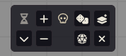
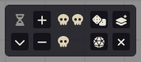
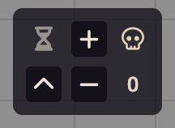
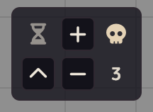
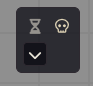
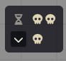
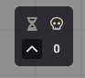
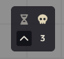

# Tension Pool 2

A Foundry VTT module that implements the Angry GM's [Tension Pool](https://theangrygm.com/making-things-complicated/) mechanic — a game master tool for building suspense through random encounters and time pressure.

Spiritual successor of [SDoehren/tension-pool](https://github.com/SDoehren/tension-pool).

## What is the Tension Pool?

The Tension Pool is a visible pool of dice placed where all players can see it. It creates escalating pressure during exploration, investigation, and other slow-paced segments of play.

- When a player takes a **time-consuming action**, the GM adds a die to the pool
- When a player takes a **reckless action**, the GM rolls the entire pool
- Any die showing a **1** triggers a **Complication** — an unexpected problem like a monster encounter, environmental hazard, or setback
- When the pool fills up, it **automatically rolls and clears**

The more dice in the pool, the higher the chance of a complication. Players can see the dice accumulating, which creates real tension at the table.

| Dice in Pool | Complication Chance (d6) |
|---|---|
| 1 | 16.7% |
| 2 | 30.6% |
| 3 | 42.1% |
| 4 | 51.8% |
| 5 | 59.8% |
| 6 | 66.5% |

## Installation

### From the Add-on Module Browser

1. In the Foundry VTT setup screen, go to the **Add-on Modules** tab
2. Click **Install Module**
3. Search for **"Tension Pool 2"** in the module browser
4. Click **Install**

### Using Manifest URL

1. In the Foundry VTT setup screen, go to the **Add-on Modules** tab
2. Click **Install Module**
3. Paste the following URL into the **Manifest URL** field at the bottom of the window:

   ```
   https://github.com/sagarc03/tension-pool-2/releases/latest/download/module.json
   ```

4. Click **Install**

### Activating the Module

Once installed, launch your world, open **Settings** > **Manage Modules**, enable **Tension Pool 2**, and click **Save Module Settings**.

## Compatibility

- Foundry VTT V13+
- Optional: [Dice So Nice](https://foundryvtt.com/packages/dice-so-nice/) for 3D dice animations

## Using the Module

The tension pool appears as a floating, draggable widget on screen. Drag it anywhere you like — your position is saved automatically. Use the toggle button to switch between **expanded** and **compact** views.

### For the GM

| Expanded (empty) | Expanded (with tension) |
|---|---|
|  |  |

| Compact (empty) | Compact (with tension) |
|---|---|
|  |  |

**Expanded view:**

- **Roll** (dice icon) — Roll the current pool and clear it. Rolling with an empty pool rolls 1 die
- **Custom Roll** (d20 icon) — Roll any number of tension dice without affecting the pool. Opens a dialog to enter the dice count
- **+** / **-** — Add or remove a die from the pool
- **Bulk Add** (layer-plus icon) — Add multiple dice at once. If the total exceeds the pool size, the pool fills up, auto-rolls, and continues adding the remainder
- **Clear** (x icon) — Empty the pool without rolling

**Compact view** hides roll, custom roll, bulk add, and clear — showing just a single icon with the dice count. The + and - buttons remain available.

When the pool reaches its maximum size, it automatically rolls and clears.

Roll results appear in the chat as a single message showing the outcome — "Complication!" with icons for each complication, or "Safe... for now."

### For Players

| Expanded (empty) | Expanded (with tension) |
|---|---|
|  |  |

| Compact (empty) | Compact (with tension) |
|---|---|
|  |  |

Players see the tension pool icons showing how many dice are currently in the pool. In expanded view, each die is shown as an individual icon. In compact view, a single icon with the count is displayed. Players can toggle between views but cannot add, remove, or roll dice.

## Settings

### GM Settings (world-level)

These settings affect all players in the world.

**Pool Size** — Maximum number of dice before the pool auto-rolls. Default: 6. Range: 1-20.

**Dice Size** — What type of die to roll. Options: d4, d6, d8, d10, d12, d20. Default: d6. A complication is always a roll of 1, so larger dice mean lower odds per die. Changing this requires a browser refresh.

**Roll Visibility** — Whether tension pool roll results are visible to everyone or only the GM. Options: Public, GM Only. Default: Public. When set to GM Only, players see an ominous "The GM rolls in secret..." message instead of the actual result.

**Complication Macro** — Enter the name of a macro to automatically run when a complication is rolled. You can enter multiple macro names separated by commas (e.g. `Play Alert, Random Encounter`). The macro receives `scope.tensionResult` with the roll data. Leave blank to disable.

**Sound Enabled** — Toggle sound effects on or off. Default: on.

**Add Die Sound** / **Remove Die Sound** / **Roll Sound** — Custom audio files for each pool action. Accepts any audio file Foundry can play. Defaults are included with the module.

### Player Settings (client-level)

Each player can customize these independently.

**Icon Theme** — Choose how tension is displayed. Options:

- **Skull** — Solid skull (tension) / outline skull (no tension)
- **Square** — Exclamation square (tension) / outline square (no tension)
- **Thunder** — Lightning bolt (tension) / sun (no tension)

Each player sees their own chosen theme, including in chat messages.

## Dice So Nice Support

If [Dice So Nice](https://foundryvtt.com/packages/dice-so-nice/) is installed, tension pool rolls show 3D animated dice. The complication face displays a "!" symbol. The dice use a dark color scheme with black edges.

## Writing Complication Macros

When a complication macro runs, it receives the roll result in `scope.tensionResult`:

```js
const { diceCount, results, hasComplication, complicationCount } = scope.tensionResult;

// Example: announce complications in chat
ChatMessage.create({
  content: `<h3>Something stirs...</h3><p>${complicationCount} complication(s) from ${diceCount} dice!</p>`
});
```

| Field | Description |
|---|---|
| `diceCount` | How many dice were rolled |
| `results` | Array of each die's value, sorted |
| `hasComplication` | `true` if any die rolled a 1 |
| `complicationCount` | How many dice rolled a 1 |

## For Module Developers

Other modules can listen for tension pool events:

```js
Hooks.on("tensionPoolRolled", (result) => { /* fires on every roll */ });
Hooks.on("tensionPoolComplication", (result) => { /* fires only on complications */ });
```

Both hooks receive the same result object described above.

### Macro API

All pool actions are available via the module API. Use these in Foundry macros or from other modules:

```js
const api = game.modules.get("tension-pool-2")?.api;
```

| Method | Description |
|---|---|
| `api.add(count?)` | Add dice to the pool (default 1, handles overflow/auto-roll) |
| `api.remove(count?)` | Remove dice from the pool (default 1, floors at 0) |
| `api.roll()` | Roll the current pool and clear it — always rolls at least 1 die |
| `api.clear()` | Clear the pool without rolling |
| `api.customRoll(count)` | Roll any number of tension dice without affecting the pool — always rolls at least 1 |
| `api.getDiceCount()` | Get the current number of dice in the pool |
| `api.getPoolSize()` | Get the configured maximum pool size |

**Example macro — add a die:**

```js
game.modules.get("tension-pool-2")?.api?.add();
```

**Example macro — roll 10 tension dice:**

```js
const result = await game.modules.get("tension-pool-2")?.api?.customRoll(10);
if (result?.hasComplication) {
  ui.notifications.warn(`${result.complicationCount} complication(s)!`);
}
```

**Waiting for the API (from another module):**

```js
Hooks.once("tensionPool2Ready", (api) => {
  // API is guaranteed to be available here
});
```

## Third-Party Assets

This module includes sound effects used under the [Pixabay Content License](https://pixabay.com/service/license-summary/). See [THIRD_PARTY_ASSETS.md](THIRD_PARTY_ASSETS.md) for full attribution.

## License

[MIT](LICENSE)

## Contributing

See [CONTRIBUTING.md](CONTRIBUTING.md) for local development setup and instructions.
