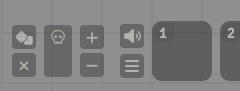
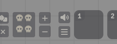
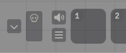
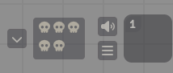

# Tension Pool 2

A Foundry VTT module that implements the Angry GM's [Tension Pool](https://theangrygm.com/making-things-complicated/) mechanic — a game master tool for building suspense through random encounters and time pressure.

Spiritual successor of [SDoehren/tension-pool](https://github.com/SDoehren/tension-pool).

## What is the Tension Pool?

The Tension Pool is a visible pool of dice placed where all players can see it. It creates escalating pressure during exploration, investigation, and other slow-paced segments of play.

- When a player takes a **time-consuming action**, the GM adds a die to the pool
- When a player takes a **reckless action**, the GM rolls the entire pool
- Any die showing a **1** triggers a **Complication** — an unexpected problem like a monster encounter, environmental hazard, or setback
- When the pool fills up, it **automatically rolls and clears**

The more dice in the pool, the higher the chance of a complication. Players can see the dice accumulating, which creates real tension at the table.

| Dice in Pool | Complication Chance (d6) |
|---|---|
| 1 | 16.7% |
| 2 | 30.6% |
| 3 | 42.1% |
| 4 | 51.8% |
| 5 | 59.8% |
| 6 | 66.5% |

## Installation

1. In Foundry VTT, go to **Add-on Modules** > **Install Module**
2. Paste the following manifest URL:
   ```
   https://github.com/sagarc03/tension-pool-2/releases/latest/download/module.json
   ```
3. Click **Install**
4. Enable "Tension Pool 2" in your world's module settings

## Compatibility

- Foundry VTT V13+
- Optional: [Dice So Nice](https://foundryvtt.com/packages/dice-so-nice/) for 3D dice animations

## Using the Module

### For the GM

Once enabled, a set of control buttons appears next to the macro hotbar. These are only visible to the GM:

| Empty Pool | With Tension |
|---|---|
|  |  |

- **Roll** (dice icon) — Roll the current pool and clear it. Rolling with an empty pool rolls 1 die
- **Custom Roll** (d20 icon) — Roll any number of tension dice without affecting the pool. Opens a dialog to enter the dice count. Useful for one-off rolls outside the normal pool flow
- **Clear** (x icon) — Empty the pool without rolling
- **+** — Add a die to the pool
- **-** — Remove a die from the pool

When the pool reaches its maximum size, it automatically rolls and clears.

Roll results appear in the chat as a single message showing the outcome — "Complication!" with icons for each complication, or "Safe... for now."

### For Players

Players see the tension pool icons next to the hotbar, showing how many dice are currently in the pool. When the pool is empty, a single outline icon is shown. As the GM adds dice, filled icons appear — one per die.

| Empty Pool | With Tension |
|---|---|
|  |  |

Players cannot add, remove, or roll dice. They can only watch the tension build.

## Settings

### GM Settings (world-level)

These settings affect all players in the world.

**Pool Size** — Maximum number of dice before the pool auto-rolls. Default: 6. Range: 1-20.

**Dice Size** — What type of die to roll. Options: d4, d6, d8, d10, d12, d20. Default: d6. A complication is always a roll of 1, so larger dice mean lower odds per die. Changing this requires a browser refresh.

**Complication Macro** — Enter the name of a macro to automatically run when a complication is rolled. You can enter multiple macro names separated by commas (e.g. `Play Alert, Random Encounter`). The macro receives `scope.tensionResult` with the roll data. Leave blank to disable.

### Player Settings (client-level)

Each player can customize these independently.

**Window Position** — Place the tension pool to the left or right of the macro hotbar. Default: Left.

**Icon Theme** — Choose how tension is displayed. Options:
- **Skull** — Solid skull (tension) / outline skull (no tension)
- **Square** — Exclamation square (tension) / outline square (no tension)
- **Thunder** — Lightning bolt (tension) / sun (no tension)

Each player sees their own chosen theme, including in chat messages.

## Dice So Nice Support

If [Dice So Nice](https://foundryvtt.com/packages/dice-so-nice/) is installed, tension pool rolls show 3D animated dice. The complication face displays a "!" symbol. The dice use a dark color scheme with black edges.

## Writing Complication Macros

When a complication macro runs, it receives the roll result in `scope.tensionResult`:

```js
const { diceCount, results, hasComplication, complicationCount } = scope.tensionResult;

// Example: announce complications in chat
ChatMessage.create({
  content: `<h3>Something stirs...</h3><p>${complicationCount} complication(s) from ${diceCount} dice!</p>`
});
```

| Field | Description |
|---|---|
| `diceCount` | How many dice were rolled |
| `results` | Array of each die's value, sorted |
| `hasComplication` | `true` if any die rolled a 1 |
| `complicationCount` | How many dice rolled a 1 |

## For Module Developers

Other modules can listen for tension pool events:

```js
Hooks.on("tensionPoolRolled", (result) => { /* fires on every roll */ });
Hooks.on("tensionPoolComplication", (result) => { /* fires only on complications */ });
```

Both hooks receive the same result object described above.

## License

[MIT](LICENSE)

## Contributing

See [CONTRIBUTING.md](CONTRIBUTING.md) for local development setup and instructions.
